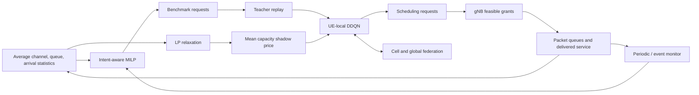

# St-INTEL

**Stackelberg-Intent Enhanced Learning based Resource Allocation in 5G Open RAN**

[](https://github.com/wsshinskku/St-INTEL/actions/workflows/ci.yml)

[한국어](README.ko.md) · [Research overview](https://wsshinskku.github.io/research/St-INTEL/) · [Method](docs/METHOD.md) · [Reproducibility](docs/REPRODUCIBILITY.md)

St-INTEL combines intent-aware optimization, resource scarcity pricing, UE-local Double DQN, and federated learning. A slow leader computes a benchmark allocation and broadcasts a scalar price; UEs learn scheduling requests, and the gNB makes feasible resource grants.

This repository is a **manuscript-based reference implementation**. It provides a runnable analytical environment and explicitly documents implementation choices where the manuscript does not determine a unique implementation. Original emulation assets and trained models were not supplied. Running this code does **not** reproduce or verify the manuscript's reported performance tables.

## What is included

- Binary resource allocation with throughput, backlog, and operator-intent slack constraints; a separate LP relaxation supplies capacity shadow prices.
- Packet queues, timestamp-based head-of-line (HOL) delay, three traffic classes, four configurable cell profiles, and stable/unstable scenarios.
- UE-local DDQN with benchmark-generated replay, target networks, and FedProx regularization.
- Cell-level and cross-cell model aggregation; periodic and event-triggered benchmark refresh with cooldown.
- Reference controls and component ablations under the same request–grant interface.
- Separate training and frozen-policy evaluation, model checkpoints, multi-seed summaries, and automated checks.



## Quick start

Python **3.10 or newer** is required. NumPy, SciPy, and PyTorch run the reference pipeline; the default example runs on CPU. No commercial optimizer or external network simulator is required.

```bash
git clone https://github.com/wsshinskku/St-INTEL.git
cd St-INTEL
python -m venv .venv
```

Activate the environment with `source .venv/bin/activate` on Linux/macOS or `.venv\Scripts\Activate.ps1` in PowerShell, then install and run:

```bash
python -m pip install -e ".[dev]"
python -m st_intel run --config configs/smoke.json --output runs/demo
python -m st_intel evaluate --checkpoint runs/demo/final.pt --output runs/eval
pytest
```

`run` trains a policy and evaluates the resulting weights in a separate environment. `evaluate` loads the saved model for another evaluation without gradient updates. The smoke configuration is a short pipeline check, not a converged experiment. Check [the validation record](docs/VALIDATION.md) for what has actually been run.

The smoke run uses two cells and eight UEs. `configs/paper_reference.json` records the manuscript's four-cell, 400-UE scale and known settings, together with documented reconstruction choices. Its 600,000 training steps plus 600,000 evaluation steps are a substantial workload and have not been run at full scale for this release.

## Compare methods

```bash
python -m st_intel suite --config configs/smoke.json --output runs/suite --methods st-intel ddqn fl-rl milp --seeds 1 2 3 4 5
python -m st_intel run --config configs/smoke.json --output runs/unstable --method st-intel --scenario unstable --seed 1
python -m st_intel run --config configs/smoke.json --output runs/no-price --method no-price --seed 1
```

| Method | Purpose |
| --- | --- |
| `st-intel` | Full reference pipeline |
| `ddqn` | Independent DDQN without leader pricing, teacher replay, or federation |
| `fl-rl` | Federated DDQN reference control without leader pricing or teacher replay |
| `milp` | Leader benchmark request policy without neural learning |
| `no-price` | Remove the scalar price from policy observations and rewards |
| `no-warmstart` | Remove teacher replay at initialization and later leader refreshes |
| `no-fl` | Remove federated coordination and its proximal reference |
| `no-events` | Keep periodic benchmark refresh, remove event-triggered refresh |

These are controlled comparisons implemented here. They are not replicas of every SG, FL, or RL method cited in the manuscript. In particular, the `fl-rl` name identifies this repository's federated DDQN control, not an implementation of the manuscript's cited FL+RL paper.

`suite` stores runs under `<output>/<method>/seed-<seed>/` and writes `summary.json` using the frozen-policy evaluation metrics. It rejects duplicate method/seed entries. `summarize` also rejects incompatible configurations so stable and unstable scenarios cannot be accidentally pooled.

## Reading results

Each run records its resolved configuration and metrics, and saves `final.pt` for evaluation. The metrics describe delivered traffic, queue delay, SLA outcomes, optimization and federation activity, and communication accounting in the reference environment. Distinguish the training and evaluation phases when comparing results.

```text
runs/demo/
├── config.json           # Resolved configuration
├── metrics.json          # Training and evaluation reports with provenance
├── final.pt              # Policy/config checkpoint for evaluation
├── train/
│   ├── metrics.json
│   ├── leader.json       # Solve reasons, prices, slack and solver diagnostics
│   ├── federation.json   # Aggregation rounds and model changes
│   └── episodes.json    # Episode reward history
└── evaluation/           # Same phase logs, with frozen learned weights
```

Summarize multiple run files with:

```bash
python -m st_intel run --config configs/smoke.json --output runs/seed1 --seed 1
python -m st_intel run --config configs/smoke.json --output runs/seed2 --seed 2
python -m st_intel summarize runs/seed1/metrics.json runs/seed2/metrics.json --output runs/summary.json
```

Use independent seeds for uncertainty estimates and the same scenario/configuration for method comparisons. A single short run supports a functional check only. See [reproduction notes](docs/REPRODUCIBILITY.md) for metric definitions, missing original assets, and configuration choices.

## Documentation

| Document | Contents |
| --- | --- |
| [METHOD.md](docs/METHOD.md) | Equations, control loops, price interpretation, implementation conventions |
| [REPRODUCIBILITY.md](docs/REPRODUCIBILITY.md) | Run protocol, manuscript settings, analytical-environment limits |
| [INTEGRATION.md](docs/INTEGRATION.md) | Required interfaces and measurements for external emulation |
| [VALIDATION.md](docs/VALIDATION.md) | Tests and experiments actually completed |

The source manuscript is not redistributed in this repository. Its existing publication record is **under review** at *Computer Communications*; this is not an acceptance claim. The manuscript gives reported results for a UERANSIM/Open5GS/QuaDRiGa/CPLEX setup whose custom coupling and experiment artifacts are unavailable here.

## Citation and license

If this implementation is useful, cite the associated manuscript and identify the repository revision used in your experiments. Publication metadata is available in [CITATION.cff](CITATION.cff).

```bibtex
@unpublished{shin2026stintel,
  title  = {St-INTEL: Stackelberg-Intent Enhanced Learning based Resource Allocation in 5G Open RAN},
  author = {Shin, Wooseok and Yang, Janghoon and Shen, Zhiqiang and Choi, Minseok and Shin, Jitae},
  year   = {2026},
  note   = {Manuscript under review at Computer Communications},
  url    = {https://github.com/wsshinskku/St-INTEL}
}
```

The reference implementation is available under the [MIT License](LICENSE). The manuscript and third-party software retain their own rights and licenses.
